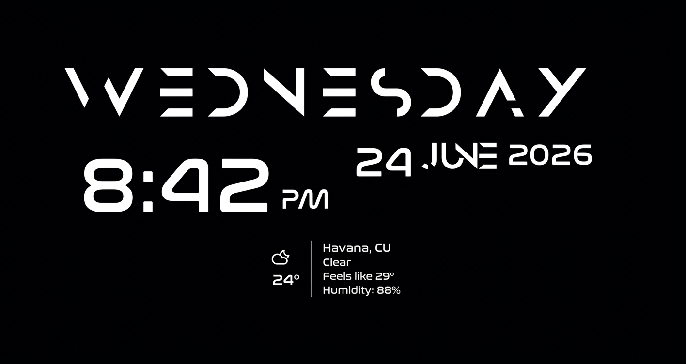

# 🕒 TimeStats - KDE Plasma 6 Widget


A modern, highly customizable clock and weather widget designed for KDE Plasma 6. Built to provide essential daily information at a glance while keeping your desktop clean and modular.



## ✨ Features

* **Advanced Time & Date:** Displays day, time, and date with full customization — each element independently toggleable.
* **Integrated Live Weather:** Accurate weather data provided by Open-Meteo, refreshed every 2 minutes.
* **Smart Location:** Auto-location detection by IP (one-time) and manual city search via Open-Meteo Geocoding.
* **Language Localization:** 22 languages for day/month names, AM/PM text, and weather conditions/labels — system default or manual override.
* **Configurable Units:** Temperature (°C/°F/K), wind speed (km/h/mph/m/s/kt), and pressure (hPa/inHg/mmHg) — auto-sets by locale on first run.
* **Weather Details:** Condition text, feels-like, humidity, wind, pressure — each with independent show/hide, font size, and color.
* **Flexible Formatting:** Choose between 12h/24h formats and toggle AM/PM styling.
* **Total Visual Control:** Three config tabs — **Appearance** (colors, fonts, sizes), **Language**, **Units** — with per-element controls to perfectly match your desktop theme.

## 📦 Installation

### From the KDE Store (Recommended)
You can easily install this widget directly from your Plasma desktop:
1. Right-click on your desktop or panel.
2. Select **Add Widgets** > **Get New Widgets** > **Download New Plasma Widgets**.
3. Search for "Mike TimeStats" and click Install.

### Manual Installation (From Source)
If you prefer to install it manually via terminal, follow these steps:

1. **Clone the repository:** Download the widget files to your computer.
```bash
git clone [https://github.com/MikeDevQH/plasma6-widget-timestats.git](https://github.com/MikeDevQH/plasma6-widget-timestats.git)
```

2. **Navigate to the folder:** Enter the directory you just downloaded.
```bash
cd plasma6-widget-timestats
```

3. **Install the widget:** Use the official KDE package tool to install the applet into your system.
```bash
kpackagetool6 -i .
```

*Note: If you have installed an older version manually and want to update it, run `kpackagetool6 -u .` instead of the `-i` command in step 3.*

## 🖋️ Credits & Typography

This widget incorporates the following third-party fonts to achieve its futuristic aesthetic. All rights belong to their respective creators:

* **[Anurati](https://befonts.com/anurati-font.html)**
* **[Nasalization](https://typodermicfonts.com/nasalization/)** 
* **[Weather Icons](https://erikflowers.github.io/weather-icons/)** by Erik Flowers.

## 📄 License

This project is licensed under the [GPLv3 License](LICENSE) - see the LICENSE file for details.

---
*Developed by [MikeDevQh](https://github.com/MikeDevQH)*
